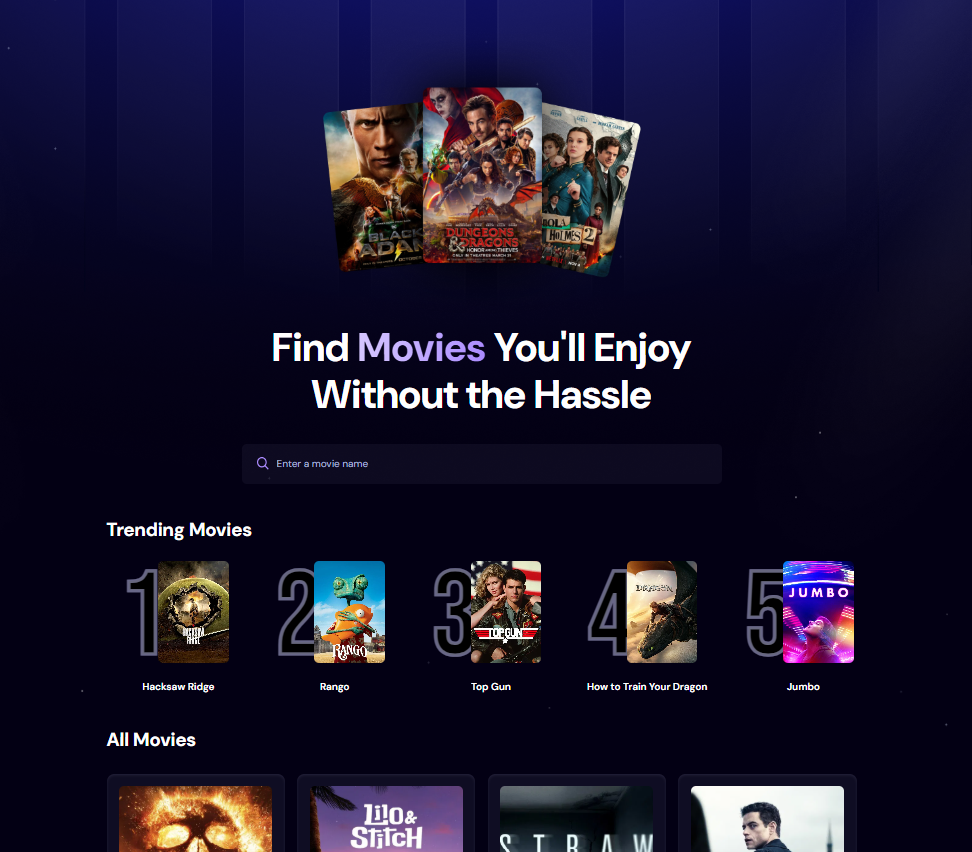

# 🎬 MovieJS

A simple web application to explore trending movies built with React and powered by Appwrite as backend service.

  
  
  
  
  
  

---

## 🚀 Demo

🔗 [Live Demo on Vercel](https://movie-js-pi.vercel.app)

---

## 📦 Tech Stack

- ⚛️ **React** — Frontend UI
- 🎯 **Appwrite** — Backend as a Service (Database, API)
- 🌐 **Vercel** — Deployment platform
- 💅 **CSS** — Styling
- 🧪 **React Hooks** — State and effect management
- 🧠 **Appwrite Query** — For filtering trending movies

---

## 📸 Screenshot

---

## 📁 Features

- 🔍 Search trending movies
- 📊 Sort movies based on popularity count
- ⚡ Debounced input search
- 🐞 Error handling when offline or fetch fails

---

## 📂 Project Structure
